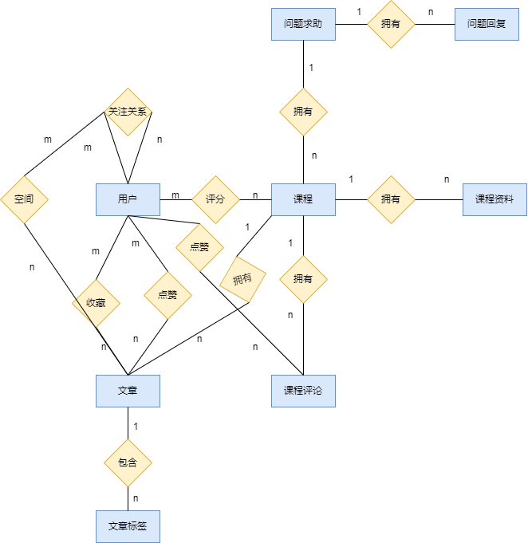

# 项目简介

本项目名为北航课程资料共享平台，是一个面向大学学生的课程资料分享、讨论和求助平台，以供各届学生交流、分享学习经验，减轻学生间信息不共享的问题

项目后端基于Ruby On Rails框架和Mysql数据库

在本平台，除了一般的交流平台所具有的用户登录注册、评论、关注、发表和收藏文章的功能之外，还包括课程评分、课程资料上传下载、问题求助等功能

本平台以课程为核心焦点，以大学学生为主要用户，来实现以课程为主要区分的资料管理和信息共享功能，解决了以往平台信息杂乱、查找低效的缺点

# 系统环境

- rails 7.1.2

- ruby 3.2.2 (2023-03-30 revision e51014f9c0) [x86_64-linux]

- Mysql 8.0.35-0ubuntu0.22.04.1 for Linux on x86_64 ((Ubuntu))

# 设计文档

## 主要功能

本项目的主要功能在于用户以及课程部分

### 用户部分

- 登录注册，以及邮箱找回密码功能

- 个性签名修改

- 以学号进行学生认证

- 关注和取消关注某个用户

- 文章收藏夹

- 求助问题列表

- 个人空间，其中显示所有关注用户以及自己发表过的所有文章

### 课程部分

- 课程

    - 课程名称以及简介

    - 课程评分，并显示所有用户评价的平均分

- 课程评论

    - 评论发布

    - 评论点赞及点赞数目

- 课程文章

    - 文章发布

    - 文章点赞、收藏及数目

    - 文章标签，并可以根据标签查找文章

- 课程资料

    - 资料上传

    - 资料下载

- 问题求助

    - 问题发布，并显示是否已经解决

    - 问题回复，并显示是否被采纳

### 权限管理

未注册时，无法访问网站，对所有网址的访问都会重定向到首页面

注册后，默认为普通用户，可以通过验证码zzzzz获得管理员权限

对于普通用户，只能修改和删除自己创建的资源，如课程、评论、文章、资料等

在问题求助板块，只有求助者能够设置问题是否已被解决，以及回复是否被采纳

访问其他用户时，只有自己可以看到自身的关注、粉丝、收藏等资源，访客无法看到

普通用户在进行以上无权限行为，或访问无权访问的网址时，会自动重定向到当前用户页面并提示无权限；而管理员则拥有几乎所有权限

## 概念模型

下面是省略了表属性的ER图

## 数据模型

### User

|列名|类型|约束|描述|
|-|-|-|-|
|id|integer|主键|\  |
|username|string|非空且唯一|用户名|
|email|string|非空且唯一|邮箱，支持忘记密码时邮箱验证|
|passwrod|string|非空|密码|
|realname|string|\  |真实姓名|
|studentcode|string|唯一|学号|
|personalsign|string|\  |个性签名|
|admin|integer|0或1|管理员(1)或普通用户(0)|

### Course

|列名|类型|约束|描述|
|-|-|-|-|
|id|integer|主键|\ |
|course_name|string|非空|课程名|
|description|string|\ |课程描述|

### CourseComment

|列名|类型|约束|描述|
|-|-|-|-|
|id|integer|主键|\ |
|content|string|非空|评论内容|
|course|integer|外键|对应的课程|
|user|integer|外键|对应的发表用户|

### Article

|列名|类型|约束|描述|
|-|-|-|-|
|id|integer|主键|\ |
|course|integer|外键|对应的课程|
|user|integer|外键|对应的发表用户|
|title|string|非空|标题|
|content|string|非空|内容|

### Followship

|列名|类型|约束|描述|
|-|-|-|-|
|id|integer|主键|\ |
|follower|integer|外键|关注者|
|following|integer|外键|被关注者|

### CourseScore

|列名|类型|约束|描述|
|-|-|-|-|
|id|integer|主键|\ |
|user|integer|外键|评分的用户|
|course|integer|外键|评分的课程|
|course_score|float|非空|分数|

### LikeCourseComment

|列名|类型|约束|描述|
|-|-|-|-|
|id|integer|主键|\ |
|like_user|integer|外键|点赞的用户|
|like_course_comment|integer|外键|点赞的评论|

### LikeArticle

|列名|类型|约束|描述|
|-|-|-|-|
|id|integer|主键|\ |
|like_user|integer|外键|点赞的用户|
|like_article|integer|外键|点赞的课程|

### FavorArticle

|列名|类型|约束|描述|
|-|-|-|-|
|id|integer|主键|\ |
|favor_user|integer|外键|收藏文章的用户|
|favor_article|integer|外键|被收藏的文章|

### CourseFile

|列名|类型|约束|描述|
|-|-|-|-|
|id|integer|主键|\ |
|course|integer|外键|资料所属的课程|
|title|string|非空|资料的名称|
|description|string|\ |资料的描述|

### ArticleTag

|列名|类型|约束|描述|
|-|-|-|-|
|id|integer|主键|\ |
|article|integer|外键|标签所属的文章|
|content|string|非空|标签的内容|

### Question

|列名|类型|约束|描述|
|-|-|-|-|
|id|integer|主键|\ |
|course|integer|外键|问题对应的课程|
|user|integer|外键|问题的发布者|
|title|string|非空|标题|
|content|string|非空|正文内容|
|solved|integer|0或1|问题已经被解决(1)或未解决(0)|

### QuestionReply

|列名|类型|约束|描述|
|-|-|-|-|
|id|integer|主键|\ |
|question|integer|外键|回答对应的问题|
|user|integer|外键|回答的发布者|
|content|string|非空|回答的内容|
|accepted|integer|0或1|回答被采纳(1)或未被采纳(0)|

